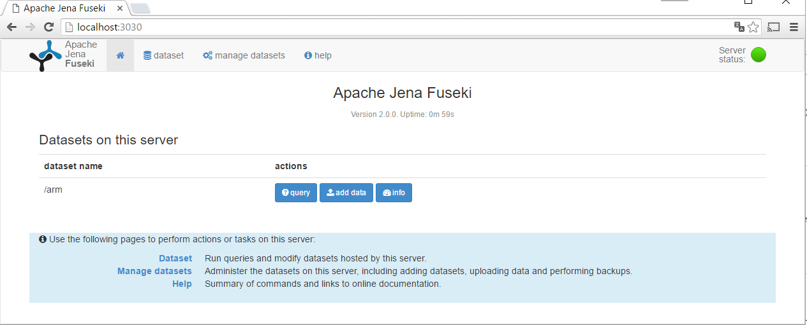
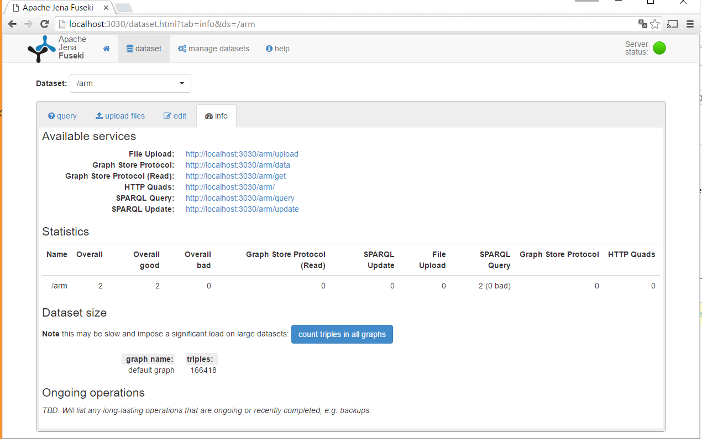
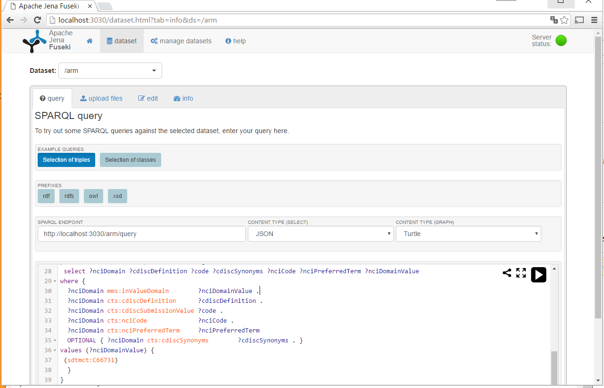
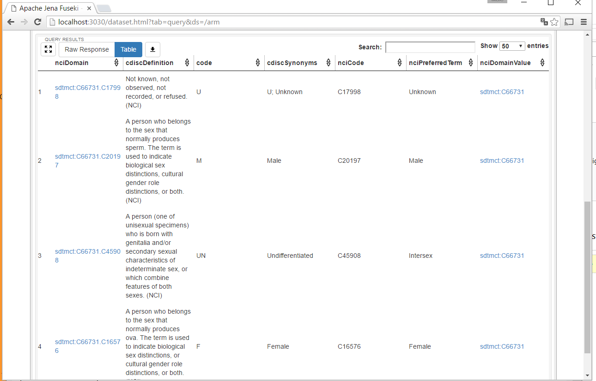

# poc-analysis-results-metadata

This repository contains programs for proof of concept for generating
tables from Analysis Results &amp; Metadata model
(http://www.phusewiki.org/wiki/index.php?title=Analysis_Results_Model),
a project under the Semantic Technology
(http://www.phusewiki.org/wiki/index.php?title=Semantic_Technology) in
the PhUSE Computational Science (CS) working groups
(http://www.phusewiki.org/wiki/index.php?title=CSS_Working_Groups).

The purpose is to show how tables for the clinical study report are
generated from analysis results and metadata stored a RDF data cubes.
The CDISC SDTM/ADaM Pilot Project
(http://www.cdisc.org/sdtmadam-pilot-project) serves as input for data
and table specification.

Several tools are used, see below for list of tools/packages.
Previous versions of Apache Jena and Apache Fuseki versions are choosen as they can be executed with Java 7. Never versions exists, but they require Java 8. 

# Setup

The recommended setup is to store all tools/packages within one
directory (see below). This simplifies reference between packages, as
relative paths can be used.

Directory structure

    apache-jena-2.13.0
    apache-jena-fuseki-2.0.0
    poc-analysis-results-metadata
    rdf.cdisc.org
    rrdfqbcrnd0
    SAS-SPARQLwrapper

## Tools/packages

The tools/packages are shown below (including the present projects).

Apache Jena - see (https://jena.apache.org/download/), download at (http://archive.apache.org/dist/jena/binaries/)

Apache Jena Fuseki - version 2.0.0, see below

* Zip (http://archive.apache.org/dist/jena/binaries/apache-jena-fuseki-2.0.0.zip)
* MD5 (http://archive.apache.org/dist/jena/binaries/apache-jena-fuseki-2.0.0.zip.md5)

Apache Jena - version 2.13.0, optional, see below

* Zip (http://archive.apache.org/dist/jena/binaries/apache-jena-2.13.0.zip)
* MD5 (http://archive.apache.org/dist/jena/binaries/apache-jena-2.13.0.zip.md5)

GitHub packages as zip files

    https://github.com/phuse-org/rdf.cdisc.org/archive/master.zip
    https://github.com/MarcJAndersen/rrdfqbcrnd0/archive/master.zip
    https://github.com/MarcJAndersen/poc-analysis-results-metadata/archive/master.zip
    https://github.com/MarcJAndersen/SAS-SPARQLwrapper/archive/master.zip

Github repositories

    https://github.com/phuse-org/rdf.cdisc.org
    https://github.com/MarcJAndersen/rrdfqbcrnd0
    https://github.com/MarcJAndersen/poc-analysis-results-metadata
    https://github.com/MarcJAndersen/SAS-SPARQLwrapper

# Installation

## Installation of files

All packages/tools are available for download.
Some of the packages are available from GitHub, and can be either downloaded as zip files or cloned from Github.

The simples approach is to install from zip files.

Cloning from GitHub gives the advantage of being able to update with one command (`git pull`), and of course all the other benefits of git. 

### Install from zip-files

Create the base directory. Download the zip files into this directory.

For Apache Jena packages verify md5 sum, unzip

For github packages, unzip, rename zip file to packagename and master. Rename directory to package name.

For a Linux/cygwin script to download etc, see (get-zip-files.sh.txt). Note: for approach for automation on windows, see (http://superuser.com/questions/25538/how-to-download-files-from-command-line-in-windows-like-wget-is-doing).

### Install from Github

Create the base directory.

For Apache Jena packages download the packages as zip files, verify md5 sum, unzip.

For github packages clone the packages into the base directory.

## Testing Apache Jena Fuseki

The following shows the results of testing the setup on Windows 10 with windows "Command Prompt" (cmd.exe) and using the directory `I:\poc-test` as base directory.

Change to apache Jena Fuseki directory, and start Fuseki.

o    cd/d I:\poc-test\apache-jena-fuseki-2.0.0
    fuseki-server.bat --config=../poc-analysis-results-metadata/res-ttl/poc-fuseki-config.ttl

This should give the following output:

    [2016-05-22 16:16:04] Server     INFO  Fuseki 2.0.0 2015-03-08T09:49:20+0000
    [2016-05-22 16:16:04] Config     INFO  FUSEKI_HOME=I:\poc-test\apache-jena-fuseki-2.0.0\.
    [2016-05-22 16:16:04] Config     INFO  FUSEKI_BASE=I:\poc-test\apache-jena-fuseki-2.0.0\run
    [2016-05-22 16:16:04] Servlet    INFO  Initializing Shiro environment
    [2016-05-22 16:16:04] Config     INFO  Shiro file: file://I:\poc-test\apache-jena-fuseki-2.0.0\run\shiro.ini
    [2016-05-22 16:16:04] Config     INFO  Configuration file: ../poc-analysis-results-metadata/res-ttl/poc-fuseki-config.ttl
    [2016-05-22 16:16:05] Builder    INFO  Service: :pocexample
    [2016-05-22 16:16:07] Config     INFO  Register: /arm
    [2016-05-22 16:16:08] Server     INFO  Started 2016/05/22 16:16:08 CEST on port 3030

To test Fuseki, open a browser window and goto (http://localhost:3030/).
The browser should show the main screen for Fuseki.

Click on the button "Info", and then on "count triples in all graphs". The browser should then show the total number of triples loaded as specified in the configuration file.

In the browser with Fuseki, click on query. In the text box delete any existing text. 

Open the file (sparql-rq/CDISC-code-list-C66731.rq). This SPARQL query returns the codelist for NCI code C66731. Copy the contents of the file to the clipboard. Paste the contents in the query window in the browser.

Click on the start triangle (right most in the query window). The results is shown as 4 rows below the query.

  
# Notes

Convert this file to html using pandoc (on windows included as of Rstudio):

    pandoc --from=markdown_github readme.md -o readme.html
